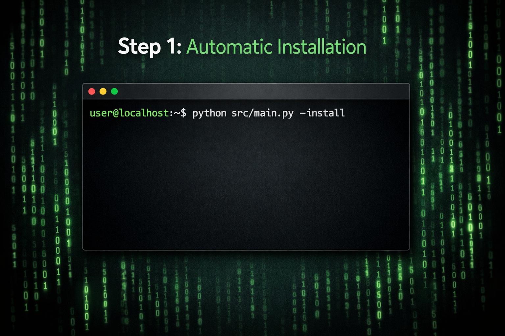
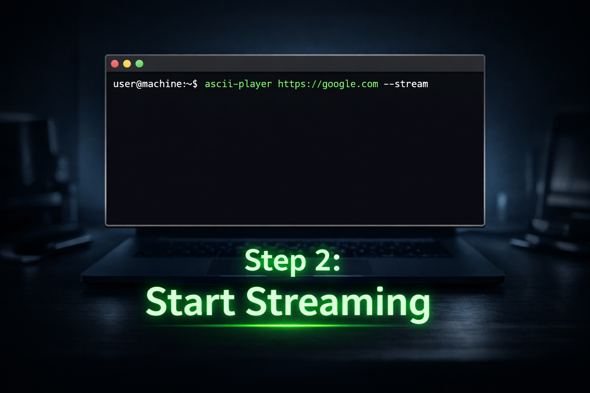
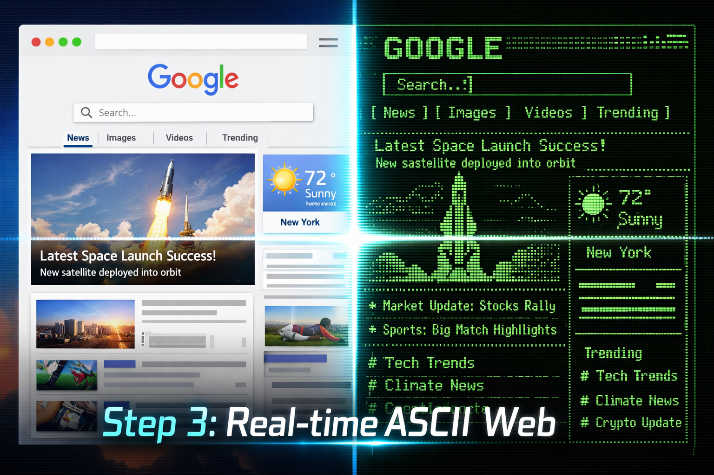

# 🌐 Live Website Streaming: Visual Guide

Follow this step-by-step visual guide to start streaming live websites as ASCII art in your terminal.

---

### Step 1: Automatic Installation
First, ensure you have the tool installed and added to your system PATH. The easiest way is to use the built-in installer flag.



```bash
python src/main.py --install
```

---

### Step 2: Start Streaming
Once installed, you can use the `ascii-player` command from any terminal. Use the `--stream` flag followed by any URL.



```bash
ascii-player https://google.com --stream
```

---

### Step 3: Enjoy Real-time ASCII Web
The tool will open a headless browser, capture the website's live frames, and render them instantly as ASCII art. You can watch dynamic content, news updates, and animations in a retro-tech aesthetic.



---

## 💡 Pro Tips
- **Terminal Mode**: The `--stream` flag automatically enables terminal mode for the best experience.
- **Refresh Rate**: The stream updates approximately every 0.5 seconds to balance performance and real-time feel.
- **Headless Browsing**: All browsing is done headlessly using Selenium, so no extra windows will pop up on your desktop.

---

[Back to README](../README.md) | [Installation Guide](../INSTALL_GUIDE.md)
